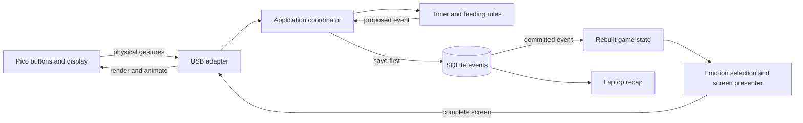

# MVP system design

One laptop Python application owns game decisions and history. A separate Pico
MicroPython program reports buttons and renders complete screen descriptions.
This is a proposed implementation; see [class_design.md](class_design.md) for APIs.

## The data flow



The application receives a button, resolves its meaning on the current screen,
asks a feature for a decision, saves the event, updates state, then sends a view.
Screen navigation alone need not create an event. The laptop scheduler follows the
same commit-before-presentation path when a focus or break timer finishes.

## Module boundaries

| Area | Owns | Allowed dependencies |
| --- | --- | --- |
| core | Typed records, commands/events, resource interfaces | Standard library types |
| features | Timer transitions, food validation, emotion selection, replay/history | Core; no USB/SQL/GPIO imports |
| app | Screen controls, scheduling, state ownership and presentation | Core and feature APIs |
| adapters | SQLite, USB, system clock, YAML and text output | Core contracts |
| devtools | Virtual Pico UI, in-memory byte transport and bounded wire trace | Core contracts and production wire codec |
| pico | Hardware input, protocol validation, drawing and sprites | MicroPython and local firmware modules |
| laptop/main.py | Construct dependencies and start/stop the laptop app | Laptop modules |

Keep feature functions pure and resource classes small. Features do not import
each other; the coordinator combines them. No generic plugin framework or separate
web service is needed. Future food options belong in food definitions, not new
copies of feeding logic.

## Host and device portability

The HP Windows laptop is the expected demo host, not an architectural dependency.
Core, feature and application modules must contain no Windows/macOS/Linux branches,
`COM` names, `/dev` paths, USB identifiers or board/display imports.

`SerialDeviceLink` hides the host serial library. It accepts a `DeviceSelector`
with an optional user-configured port and optional USB identity fields. If no port
is configured, its adapter enumerates candidates using portable serial metadata.
No matches and multiple matches return clear diagnostics; code must not silently
pick the first port. Store port names in configuration or runtime state, never in
gameplay events. Tests use a fake enumerator/backend and cover Windows-style and
POSIX-style names without requiring either OS.

Hardware variation is isolated on the other side of the wire: Pico pins live in
hardware configuration and display/controller operations live behind
`DisplayDriver`. A new compatible board or display may require a firmware adapter
and configuration change, but must not require edits to laptop game rules or the
versioned protocol.

## Runtime profiles

The composition root accepts an explicit `dev` or `hardware` profile. Both build
the same application, features, reducer, presenter and wire codec. `dev` supplies
the virtual Pico, safe temporary storage and optional fake clock; `hardware`
supplies serial USB, the user's SQLite database and system clock. Profile checks
stay at composition/adapter boundaries and never appear in feature rules.

The [development modes design](development_modes.md) defines the clickable device,
wire trace and safety boundaries. Its clicks and renders cross the real JSON codec
through an in-memory byte transport, allowing laptop/Pico integration debugging
without a physical board.

## Planned folders

The paths below are module boundaries, not assigned people or a requirement to
create empty files. Individual work is claimed in [todo.md](todo.md).

```text
AGENTS.md                         # entry point
README.md                         # repository overview and runtime boundaries
docs/                             # current product/design/reference documents
contracts/                        # runtime-neutral protocol and event fixtures
laptop/                           # CPython 3.14.6 uv project
  pyproject.toml                  # laptop dependencies, Ruff and Pyright settings
  uv.lock                         # reproducible laptop dependency lock
  .python-version                 # laptop CPython selection only
  README.md                       # laptop setup/check instructions
  main.py                         # future laptop composition root and CLI
  config.yaml                     # future user-tunable laptop rules/settings
  src/deskpet/
    core/
      models.py                   # immutable session, offer, reaction and state records
      commands.py                 # typed semantic commands
      events.py                   # versioned envelope and payload unions
      views.py                    # screen, labels and animation records
      ports.py                    # EventStore, DeviceLink, Clock
      config.py                   # validated configuration types
    features/
      timers.py                   # focus AND break start/pause/resume/end/complete
      feeding.py                  # one food through extensible food definitions
      emotions.py                 # recorded reactions + activity -> mood
      replay.py                   # deterministic event -> state
      history.py                  # streak and weekly queries
    app/
      application.py              # the single state owner
      controls.py                 # action definitions, configurable bindings and labels
      scheduling.py               # timer samples/deadlines, interruption handling
      presenter.py                # state/runtime -> screen snapshot
    adapters/
      serial_link.py              # portable discovery, queued I/O, connection/heartbeat
      wire_codec.py               # laptop message validation and encoding
      sqlite_event_store.py       # durable append/read and single-writer lock
      system_clock.py             # UTC and monotonic time, resume detection
      config_loader.py            # YAML -> typed configuration
      text_report.py              # read-only report formatting
      fakes.py                    # fake store/device/clock
    devtools/
      virtual_pico.py             # simulated device state and button messages
      transport.py                # in-memory encoded-byte connection
      trace.py                    # bounded bidirectional protocol diagnostics
      ui.py                       # clickable local virtual-device view
  tests/                          # laptop unit/integration tests
pico/
  README.md                       # firmware/hardware setup and flashing notes
  MICROPYTHON_VERSION             # exact tested firmware; currently UNPINNED
  main.py                         # cooperative loop
  protocol.py                     # firmware JSON/session validation
  buttons.py                      # debounce and press/hold detection
  display.py                      # layouts and nonblocking animations
  lcd_driver.py                   # hardware-specific drawing
  sprites.py                      # full pet, small faces, food and animations
  hardware_config.py              # pins, orientation and debounce
  tests/                          # firmware parser/gesture/render checks
```

## Reducer-style state updates

Use the same functional pattern as a React reducer: current state plus a recorded
event produces a new immutable state. In Python, call this function
`replay.apply_event(state, event)`; the descriptive name is intentional. No reducer
library or framework is required.

The application follows this sequence:

```text
button → semantic command → decide → save event → apply_event → present → USB
```

A command is a request that may be rejected, such as PauseSession. An event is an
accepted fact, such as session_paused with its resolved active time. Feature
`decide` functions check requests using explicitly supplied state, time and rules.
The coordinator persists the accepted event before applying it. If saving fails,
it does not advance game state or publish a success animation.

`apply_event` returns new state without changing the input or performing I/O.
It validates history transitions but does not recalculate outcomes using current
configuration. `rebuild` repeatedly calls that same function over saved events;
live updates and restart recovery must never have separate transition logic.
Clocks, UUID generation, SQLite writes, USB sends and animations belong outside
this function. One application loop owns the current state reference.

Keep dispatch small; split transition handlers by feature when their size warrants
it. Avoid one enormous reducer shared by every contributor. Temporary UI navigation
uses `controls.navigate` and remains separate from durable events; countdown and
mood are projections of state and explicit time, not per-second saved events.

## Three kinds of state

- GameState: reconstructable facts, including active/paused session and saved
  elapsed sample, last confirmed duration, pending break offer, recent reaction,
  and qualifying focus dates. No wallet, inventory or numeric pet stats.
- RuntimeState: live monotonic anchor, selected setup duration, current screen and
  control epoch, connection state and animation bookkeeping. Not replayed.
- RenderSnapshot: exactly what the Pico should draw: screen, mood, time values,
  paused flag and an ID-tagged list of button labels (two in the default build).
  No business-rule parameters.

Reactions expire through an explicit clock query; focus duration changes only
through timer rules. A screen refresh changes neither the history nor a session.

## Responsiveness and action order

A background USB reader validates and enqueues input. The application waits on
the input queue with a timeout to its next deadline, so buttons wake it immediately.
Only this loop writes GameState. A separate writer handles USB output; newest
snapshots replace older unsent ones and transient cues use a bounded queue.

Before handling an input, check for an interruption, then due completion. Recheck
the input's connection ID and control_epoch against the current screen after that
work. A stale End or Pause must not become Home or Start break on a new screen.
Increment the control epoch when button meanings change (navigation, pause/resume,
completion); ordinary clock/mood/countdown refreshes leave it unchanged.

Each feature decision is either one event, a normal rejection or a no-op. Commit
an event before applying it to state or changing the timer's live anchor. Newly committed
events may generate animations; replay and duplicate appends may not.

Wake at least every second while connected/running, at timer deadlines, and at
reaction expiries. Paused countdowns do not change. Enqueueing a snapshot/cue must
not block the loop on the device. If the input queue overflows, reset the device
connection and discard old-session inputs rather than execute stale actions.
See [event_model.md](event_model.md) for exact clock and pause arithmetic.

## Startup and failures

1. Validate config, acquire the database writer lock, and replay events. An empty
   log gets one pet_created event; initial screen is Home.
2. End any replayed unfinished timer neutrally using its last saved elapsed value.
   Restore a saved pending break offer; otherwise show Home.
3. Open USB and handshake independently. After ready, send the full current screen.
   Reconnect does not replay gestures or animations and does not stop the timer.

USB loss alone leaves the laptop timer running; firmware shows a neutral connection
overlay and hides stale countdowns. App restart, system sleep or a long clock gap
ends unfinished timers neutrally instead of treating the gap as focus.

Storage failure keeps the last committed state, freezes gameplay and exposes a
storage error. Recover by replaying and applying the neutral interruption policy
before accepting new actions. Never silently swap to an empty database. Graceful
shutdown records a neutral session end, then stops workers and closes resources.
Unsupported/corrupt stored events stop writable startup; wire compatibility has
its own discard/handshake policy.

## Configuration

Use namespaced sections: identity, focus, feeding, controls, ui and device. Defaults include
allowed_focus_minutes [5,10,...,60], default_focus_minutes 25, break_ratio 0.2,
minimum_break_minutes 1, grace_active_seconds 60, happy_seconds 30 and sad_seconds 30.
Feeding has default_food_id basic and a definitions mapping containing basic's
sprite_id food_basic and content_seconds 20. One free food is the entire MVP.

Validate that the default is allowed, durations fit protocol limits, reaction
durations are positive, and referenced food/assets exist. Store resolved focus/
break/reaction terms in events. Configuration loads at startup; hot reload is
deferred. The controls section maps screen context/button/gesture to action IDs.
Action definitions supply labels and availability to input handling and presentation;
layout stays in rendering. Hardware ID/pin/layout entries stay on Pico.
See the [button extension recipe](class_design.md). Protocol constants are versioned contracts.

## First post-MVP extension

Add progression and optional keyboard/camera adapters through existing ports and
event processing. XP/coins and level-up bonuses belong on the laptop; Pico receives
display values for a top strip. Keyboard/head inputs have independent on/off settings.
[Progression design](progression_design.md) owns calculation, persisted policies/
summaries and retry behavior. Do not add these to MVP state or event schemas early.
There is no future health/hunger/friendship subsystem.
