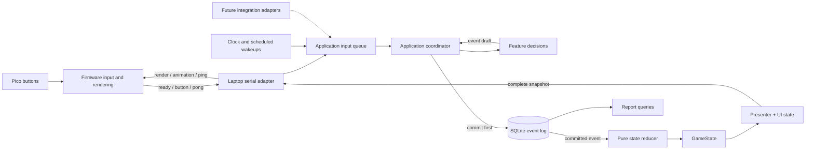

# MVP system design

Status: implementation blueprint. See [class_design.md](class_design.md) for API
contracts and [serial_protocol.md](serial_protocol.md) for exact wire messages.

## Architecture

Use a modular monolith on the laptop and an independent MicroPython peripheral.
There is one application process, one authoritative event log, and one state owner.
Modules are boundaries for ownership/testing, not separate deployed services.



## Dependency boundaries

| Area | Owns | May depend on | Must not own |
| --- | --- | --- | --- |
| `core/` | Immutable records, command/event definitions, ports | Standard library types | I/O, rule evaluation, hardware |
| `features/` | Pet, focus, shop rules; deterministic event application; reports | `core/` | Serial messages, GPIO, SQLite SQL, global state |
| `app/` | Input routing, deadlines, state ownership, UI/presentation | Core and feature APIs | GPIO/display details, SQL, duplicated feature rules |
| `adapters/` | SQLite, USB, system clock, text report formatting | Core contracts; wire codec for serial | Deciding rewards or updating game state |
| `main.py` | Construct dependencies and run/stop application | All laptop areas | Business rules |
| `pico/` | Device parsing, debounce, display, animation | MicroPython and local firmware modules | Laptop imports or game logic |

Use constructor injection for resources. Do not add a dependency injection
framework, generic event bus, repository per entity, or dynamically loaded plugin
system. A fixed command dispatch table and reducer dispatch table are enough.
Feature modules do not import each other; the application composes their results.

## Planned layout

Paths below are to be created during implementation, not existing files.

```text
AGENTS.md                        # contributor/LLM entry point and documentation map
docs/                            # product, architecture, API and planning documents
main.py                          # laptop composition root and CLI selection
config.yaml                      # laptop rules, controls and device settings
pyproject.toml                   # laptop dependencies and checks
src/deskpet/
  core/
    models.py                    # GameState and immutable value records
    commands.py                  # application/domain command union
    events.py                    # event envelope, typed payloads, schema versions
    views.py                     # render snapshot and animation records
    ports.py                     # EventStore, DeviceLink, Clock interfaces
    config.py                    # validated configuration records (no YAML I/O)
  features/
    pet.py                       # feeding, tricks, online decay
    focus.py                     # session start/cancel/complete
    shop.py                      # accessory purchase/equip
    history.py                   # streak and recap queries
    replay.py                    # fixed event reducer dispatch and state fold
  app/
    application.py               # one owner of game/UI state
    controls.py                  # physical input -> semantic command
    presenter.py                 # state/UI/time -> display snapshot and feedback
    scheduling.py                # elapsed time, due work, suspend-gap detection
  adapters/
    serial_link.py               # read/write workers, reconnect, bounded queues
    wire_codec.py                # laptop JSON Lines validation/encoding
    sqlite_event_store.py        # schema, append, read, uniqueness
    system_clock.py              # UTC/monotonic clock implementation
    config_loader.py             # YAML -> validated Rules/AppConfig
    text_report.py               # report -> terminal/text
    fakes.py                     # fake device, clock and in-memory event store
pico/
  main.py                        # construct hardware and run cooperative loop
  protocol.py                    # MicroPython codec/session validation
  buttons.py                     # ButtonScanner and debounce state
  display.py                     # Renderer and DisplayDriver boundary
  lcd_driver.py                  # selected hardware-specific implementation
  sprites.py                     # pet/accessory/progress/animation assets
  hardware_config.py             # pins, polarity, orientation, debounce settings
tests/
  contracts/                     # shared protocol fixtures and golden event log
  domain/                        # feature/replay/clock-boundary checks
  storage/                       # durability, uniqueness, corruption handling
  app/                           # fake-device integration scenarios
  firmware/                      # parser/debounce/renderer checks where feasible
data/                            # ignored local database; no personal data in git
```

Keep closely related functions in these files initially. Split a feature into a
package only when it becomes hard to navigate or needs separate ownership. The
directory tree is an ownership map, not a mandate to create empty files at once.

## State and runtime flow

Three distinct records:

- `GameState`: durable projection of events: pet stats, coins, owned/equipped
  accessories, active session terms, qualifying focus dates, last applied sequence.
- `UiState`: temporary view selection, selected menu item, feedback, animation
  timing, active runtime deadline, decay remainder and connection status.
- `RenderSnapshot`: only what firmware needs to draw this screen. No reward
  parameters, event history, user identity, or business decisions.

The serial reader validates input and queues it immediately. The application
blocks on that queue with a timeout to its next scheduled deadline, so a button
wakes it without waiting for a timer tick. Only the application changes state.
The writer owns serial writes; full snapshots coalesce to the newest pending
snapshot. Animation cues have a small bounded queue and may be dropped if stale.
No blocking hardware I/O runs on the state-owning loop.

Each mutating command follows this order:

1. Refresh clock data, handle interruption detection, and process already-due
   session/decay work before interpreting the next input.
2. Map the validated button to a semantic command using `UiState`.
3. Ask the owning feature for a pure `Decision`: one event draft or a rejection.
4. Build an envelope and append the event transactionally. Do not update state if
   persistence fails. MVP commands need at most one event each; its payload can
   contain both a purchase debit and its item/stat effect.
5. Apply a newly committed event to `GameState`; update temporary UI as needed.
6. Build and publish a complete snapshot, then optional live animation cues.
   Duplicate appends and startup replay never generate another celebration.

For the MVP, evaluate timer display at least once per second and wake precisely
at the focus deadline. Accumulate awake elapsed time for configurable decay
intervals (proposed 60 seconds); do not write an event for every display tick.
Pet mutations settle any pending whole decay intervals first, preserving ordering.
Zero-effect decay need not write a new event.

The application and serial queues must be bounded. Coalesce periodic wakeups;
preserve accepted button order. If input capacity is exhausted, reset the device
session and discard queued inputs from that connection, record a diagnostic, and
resynchronize. Do not silently reinterpret stale presses against a new menu.

## Startup, recovery, and failure

- Validate configuration before opening gameplay. Acquire the database's exclusive
  game-process lock, then open SQLite and replay events
  by local sequence. On an empty log, append `pet_created` with initial values.
- If replay leaves an active session, append a neutral `focus_cancelled` with
  reason `app_restart` before accepting new gameplay. Do not reconstruct a live
  deadline from wall time. Show the clock after recovery.
- Open USB independently of startup; the game and reports work without it.
  Establish a fresh connection ID, validate the ready response, and publish the
  latest full view. Never replay queued old button actions or animations.
- Use monotonic elapsed time for live timers; UTC is for event timestamps/reports.
  Detect system resume or a large loop gap before evaluating completion. Cancel
  focus neutrally and discard that gap's decay. See the precise time policy in
  [event_model.md](event_model.md).
- Unplugging USB preserves game progress. A stalled/unavailable device must not
  block event persistence, the timer, or reports.
- If persistence fails, keep the last committed state, pause accepting gameplay,
  and show/log a storage error. On recovery, replay first and apply neutral
  interruption policy before accepting new commands. Never fall back silently to
  a fresh empty database or grant unpersisted rewards.
- Corrupt or unsupported domain events stop writable startup with an actionable
  error. Unknown wire fields are a separate compatibility concern and can be ignored.
- Graceful shutdown records a neutral cancellation for an active session, stops
  workers, closes serial and SQLite. A crash is handled by startup recovery.

## Configuration ownership

`config.yaml` has namespaced sections: `identity`, `pet`, `focus`, `shop`,
`controls`, `ui`, and `device`. Examples include stable local user/device IDs,
report timezone, initial stats, decay intervals/rates, mood thresholds, care
effects, focus duration/rewards, item prices, menu mappings, feedback duration,
serial port and heartbeat settings. Configuration loads at startup; hot reload is
deferred. Validate nonnegative prices/rewards, valid stat ranges, positive
durations, available action/asset IDs and a usable free-care path.

Hardware pins/debounce live only in `pico/hardware_config.py`. Serial schema,
maximum line size and supported UI vocabulary are versioned contracts, not
arbitrary user-tunable configuration.
