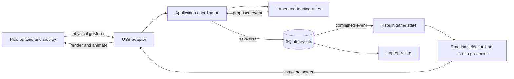

# MVP system design

One laptop Python application owns game decisions and history. A separate Pico
MicroPython program reports buttons and renders complete screen descriptions.
This is a proposed implementation; see [class_design.md](class_design.md) for APIs.

## The data flow



The application receives a button, resolves its meaning on the current screen,
asks a feature for a decision, saves the event, updates state, then sends a view.
Screen navigation alone need not create an event. The laptop scheduler follows the
same commit-before-presentation path when a focus or break timer finishes.

## Module boundaries

| Area | Owns | Allowed dependencies |
| --- | --- | --- |
| core | Typed records, commands/events, resource interfaces | Standard library types |
| features | Timer transitions, food validation, emotion selection, replay/history | Core; no USB/SQL/GPIO imports |
| app | Screen controls, scheduling, state ownership and presentation | Core and feature APIs |
| adapters | SQLite, USB, system clock, YAML and text output | Core contracts |
| pico | Hardware input, protocol validation, drawing and sprites | MicroPython and local firmware modules |
| main.py | Construct dependencies and start/stop the laptop app | Laptop modules |

Keep feature functions pure and resource classes small. Features do not import
each other; the coordinator combines them. No generic plugin framework or separate
web service is needed. Future food options belong in food definitions, not new
copies of feeding logic.

## Planned folders

The paths below are an ownership map, not a requirement to create empty files.

```text
AGENTS.md                         # entry point
docs/                             # current product/design/reference documents
main.py                           # laptop composition root and CLI
config.yaml                       # user-tunable laptop rules/settings
pyproject.toml                    # dependencies and type-checker settings
src/deskpet/
  core/
    models.py                     # immutable session, offer, reaction and state records
    commands.py                   # typed semantic commands
    events.py                     # versioned envelope and payload unions
    views.py                      # screen, labels and animation records
    ports.py                      # EventStore, DeviceLink, Clock
    config.py                     # validated configuration types
  features/
    timers.py                     # focus AND break start/pause/resume/end/complete
    feeding.py                    # one food through extensible food definitions
    emotions.py                   # recorded reactions + activity -> mood
    replay.py                     # deterministic event -> state
    history.py                    # streak and weekly queries
  app/
    application.py                # the single state owner
    controls.py                   # current screen + physical button -> intent
    scheduling.py                 # timer samples/deadlines, interruption handling
    presenter.py                  # state/runtime -> screen snapshot
  adapters/
    serial_link.py                # queued read/write, connection/heartbeat
    wire_codec.py                 # laptop message validation and encoding
    sqlite_event_store.py         # durable append/read and single-writer lock
    system_clock.py               # UTC and monotonic time, resume detection
    config_loader.py              # YAML -> typed configuration
    text_report.py                # read-only report formatting
    fakes.py                      # fake store/device/clock
pico/
  main.py                         # cooperative loop
  protocol.py                     # firmware JSON/session validation
  buttons.py                      # debounce and press/hold detection
  display.py                      # layouts and nonblocking animations
  lcd_driver.py                   # hardware-specific drawing
  sprites.py                      # full pet, small faces, food and animations
  hardware_config.py              # pins, orientation and debounce
tests/
  contracts/                      # shared wire examples and golden event history
  domain/                         # timers/feeding/emotions/replay/history
  storage/                        # commit, deduplication, recovery
  app/                            # fake device integration
  firmware/                       # parser, gestures and render behavior
data/                             # ignored local database
```

## Three kinds of state

- GameState: reconstructable facts, including active/paused session and saved
  elapsed sample, last confirmed duration, pending break offer, recent reaction,
  and qualifying focus dates. No wallet, inventory or numeric pet stats.
- RuntimeState: live monotonic anchor, selected setup duration, current screen and
  control epoch, connection state and animation bookkeeping. Not replayed.
- RenderSnapshot: exactly what the Pico should draw: screen, mood, time values,
  paused flag and two button labels. No business-rule parameters.

Reactions expire through an explicit clock query; focus duration changes only
through timer rules. A screen refresh changes neither the history nor a session.

## Responsiveness and action order

A background USB reader validates and enqueues input. The application waits on
the input queue with a timeout to its next deadline, so buttons wake it immediately.
Only this loop writes GameState. A separate writer handles USB output; newest
snapshots replace older unsent ones and transient cues use a bounded queue.

Before handling an input, check for an interruption, then due completion. Recheck
the input's connection ID and control_epoch against the current screen after that
work. A stale End or Pause must not become Home or Start break on a new screen.
Increment the control epoch when button meanings change (navigation, pause/resume,
completion); ordinary clock/mood/countdown refreshes leave it unchanged.

Each feature decision is either one event, a normal rejection or a no-op. Commit
an event before reducing state or changing the timer's live anchor. Newly committed
events may generate animations; replay and duplicate appends may not.

Wake at least every second while connected/running, at timer deadlines, and at
reaction expiries. Paused countdowns do not change. Enqueueing a snapshot/cue must
not block the loop on the device. If the input queue overflows, reset the device
connection and discard old-session inputs rather than execute stale actions.
See [event_model.md](event_model.md) for exact clock and pause arithmetic.

## Startup and failures

1. Validate config, acquire the database writer lock, and replay events. An empty
   log gets one pet_created event; initial screen is Home.
2. End any replayed unfinished timer neutrally using its last saved elapsed value.
   Restore a saved pending break offer; otherwise show Home.
3. Open USB and handshake independently. After ready, send the full current screen.
   Reconnect does not replay gestures or animations and does not stop the timer.

USB loss alone leaves the laptop timer running; firmware shows a neutral connection
overlay and hides stale countdowns. App restart, system sleep or a long clock gap
ends unfinished timers neutrally instead of treating the gap as focus.

Storage failure keeps the last committed state, freezes gameplay and exposes a
storage error. Recover by replaying and applying the neutral interruption policy
before accepting new actions. Never silently swap to an empty database. Graceful
shutdown records a neutral session end, then stops workers and closes resources.
Unsupported/corrupt stored events stop writable startup; wire compatibility has
its own discard/handshake policy.

## Configuration

Use namespaced sections: identity, focus, feeding, ui and device. Defaults include
allowed_focus_minutes [5,10,...,60], default_focus_minutes 25, break_ratio 0.2,
minimum_break_minutes 1, grace_active_seconds 60, happy_seconds 30 and sad_seconds 30.
Feeding has default_food_id basic and a definitions mapping containing basic's
sprite_id food_basic and content_seconds 20. One free food is the entire MVP.

Validate that the default is allowed, durations fit protocol limits, reaction
durations are positive, and referenced food/assets exist. Store resolved focus/
break/reaction terms in events. Configuration loads at startup; hot reload is
deferred. UI labels/layout are presenter responsibilities, not tunable game rules.
Hardware settings stay on Pico. Protocol constants are versioned contracts.
